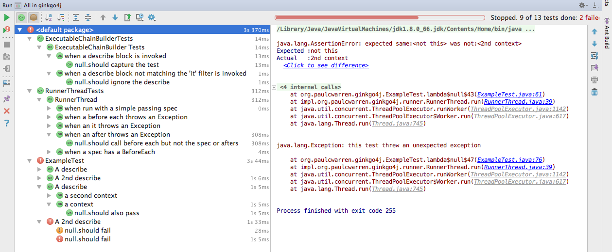

# Ginkgo4j
##A Java BDD Testing Framework  (based on [ginkgo](http://onsi.github.io/ginkgo/))

[](https://travis-ci.org/paulcwarren/ginkgo4j)

Currently supports:-
- Describe, Context, BeforeEach, JustBeforeEach, It and AfterEach constructs
- Focusing of tests through FDescribe, FContext and FIt constructs
- Any level of nested contexts
- Threaded execution (default is 4 threads)
- Integrated into junit (works in IDEs)
- Integrated into maven 
- Supports spring allowing test classes to use a spring application context  

## Getting Started

- Create a junit test class
- Add the following import:-
```
import static org.paulcwarren.ginkgo4j.Ginkgo4jDSL.*;
```
- Annotate your test class with:-
```
@RunWith(Ginkgo4jRunner.class)
```
- And the following template:-
```
	{
		Describe("Replace me", () -> {
			It("Replace me too", () -> {
				fail("Not yet implemented");
			});
		});
	}
``` 
- Optionally, you can control the number of threads used with `@Ginkgo4jConfiguration(threads = 1)`

See [ExampleTests.java](https://github.com/paulcwarren/ginkgo4j/blob/master/src/test/java/org/paulcwarren/ginkgo4j/ExampleTests.java) for a working example. 
	
## Getting Started with Spring

- Create a junit test
- Annotate your test class with:-
```
@RunWith(Ginkgo4jSpringRunner.class)
```
- Add the following import:-
```
import static org.paulcwarren.ginkgo4j.Ginkgo4jDSL.*;
```
- Add the following template:-
```
	{
		Describe("Replace me", () -> {
			It("Replace me too", () -> {
				fail("Not yet implemented");
			});
		});
	}
	@Test
	public void noop() {
	}
```
- Optionally, you can control the number of threads used with `@Ginkgo4jConfiguration(threads = 1)`

See [Ginkgo4jSpringApplicationTests.java](https://github.com/paulcwarren/ginkgo4j/blob/master/src/test/java/org/paulcwarren/ginkgo4j/spring/Ginkgo4jSpringApplicationTests.java) for a working example. 	

## Screenshots
### Eclipse


### Intellij

